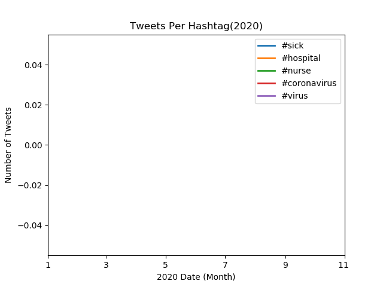

In this project, I use geotagged tweets sent in 2020 to create visualizations showing the number of tweets with the hashtags "#coronavirus" and "#코로나바이러스" respectively for the tweet country and language. More specifically, I used the MapReduce procedure to analyze the tweets. Firstly, I mapped the tweets based on their country and language, which yielded files for each day of 2020 for country and language respectively. Next, I combined the country and language files together respectively. Finally, I created the visualizations below using the matplotlib library. 

Below, I created a line plot that should show the number of occurrences of different hashtags over the course of 2022. I am in the process of fitting the lines on. 

